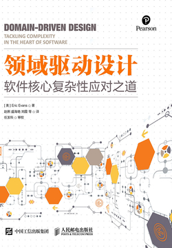

# 领域驱动设计 中文

  

## 序

## 目录

- [第一部分 运用领域模型](part1.md)
- [第 1 章 消化知识](ch1.md)
- [第 2 章 交流与语言的使用](ch2.md)
- [第 3 章 绑定模型和实现](ch3.md)
- [第二部分 模型驱动设计的构造块](part2.md)
- [第 4 章 分离领域](ch4.md)
- [第 5 章 软件中所表示的模型](ch5.md)
- [第 6 章 领域对象的生命周期](ch6.md)
- [第 7 章 使用语言：一个扩展的示例](ch7.md)
- [第三部分 通过重构来加深理解](part3.md)
- [第 8 章 突破](ch8.md)
- [第 9 章 将隐式概念转变为显式概念](ch9.md)
- [第 10 章 柔性设计](ch10.md)
- [第 11 章 应用分析模式](ch11.md)
- [第 12 章 将设计模式应用于模型](ch12.md)
- [第 13 章 通过重构得到更深层的理解](ch13.md)
- [第四部分 战略设计](part4.md)
- [第 14 章 保持模型的完整性](ch14.md)
- [第 15 章 精炼](ch15.md)
- [第 16 章 大型结构](ch16.md)
- [第 17 章 领域驱动设计的综合运用](ch17.md)
- [后记](conclusion.md)
