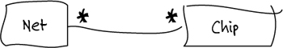
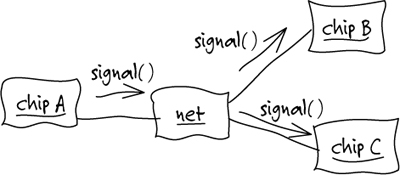
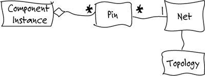
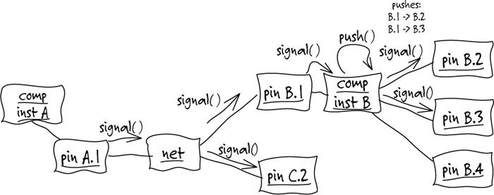
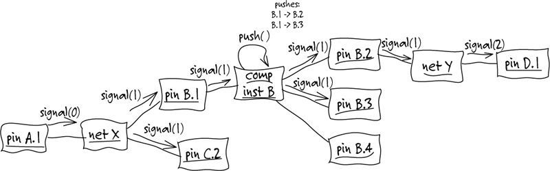
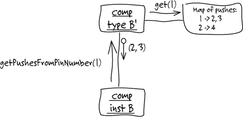
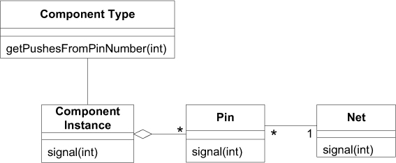

# 第 1 章 消化知识

> One. Crunching Knowledge

A few years ago, I set out to design a specialized software tool for printed-circuit board (PCB) design. One catch: I didn’t know anything about electronic hardware. I had access to some PCB designers, of course, but they typically got my head spinning in three minutes. How was I going to understand enough to write this software? I certainly wasn’t going to become an electrical engineer before the delivery deadline!

> 几年前，我着手设计一个用于设计印制电路板（PCB）的专用软件工具。但有一个问题，我对电子硬件一无所知。当然，我也曾拜访过一些 PCB 设计师，但用不了 3 分钟，他们就令我晕头转向。如何才能了解足够多的知识，以便开始编写这个软件呢？当然，我并不打算在交付期限到来之前成为电子工程师。

We tried having the PCB designers tell me exactly what the software should do. Bad idea. They were great circuit designers, but their software ideas usually involved reading in an ASCII file, sorting it, writing it back out with some annotation, and producing a report. This was clearly not going to lead to the leap forward in productivity that they were looking for.

> 我们试着让 PCB 设计师说明软件具体应该做些什么，但我们错了。虽然他们是优秀的电路设计师，但软件知识却太有限了，往往只知道如何读取一个 ASCII 文件、对它排序，然后添加一些注释并将它写回文件中，再生成一个报告。这些知识显然无法帮助他们大幅度提高效率。

The first few meetings were discouraging, but there was a glimmer of hope in the reports they asked for. They always involved “nets” and various details about them. A net, in this domain, is essentially a wire conductor that can connect any number of components on a PCB and carry an electrical signal to everything it is connected to. We had the first element of the domain model.

> 最初的几次会面令人气馁，但我们在他们要求的报告中也看到了一丝希望。这些报告中总是涉及 net 这个词以及与其相关的各种细节。在这个领域中，net 实质上是一种导线，它可以连接 PCB 上任意数量的元件，并向它连接的所有元件传递电子信号。这样，我们就得到了领域模型的第一个元素，如图 1-1 所示。


Figure 1.1

I started drawing diagrams for them as we discussed the things they wanted the software to do. I used an informal variant of object interaction diagrams to walk through scenarios.

> 就这样，我们一边讨论所需的软件功能，一边开始画图。我使用一种非正式的、稍加变化的对象交互图来走查[插图]各种场景，如图 1-2 所示。


Figure 1.2

PCB Expert 1: The components wouldn’t have to be chips.

> PCB 专家 1：元件不一定就是芯片（chip）。

Developer (Me): So I should just call them “components”?

> 开发人员（我）：那它们是不是只应该叫做“元件”？

Expert 1: We call them “component instances.” There could be many of the same component.

> 专家 1：我们将它们称作“元件实例”（component instance）。相同的元件可能有很多。

Expert 2: The “net” box looks just like a component instance.

> 专家 2：他把“net”画成和元件实例一样的框了。

Expert 1: He’s not using our notation. Everything is a box for them, I guess.

> 专家 1：他没有使用我们的符号。我猜想，他要把每一项都画成方框。

Developer: Sorry to say, yes. I guess I’d better explain this notation a little more.

> 开发人员：很抱歉，是这样的。我想我最好对这个符号稍加解释。

They constantly corrected me, and as they did I started to learn. We ironed out collisions and ambiguities in their terminology and differences between their technical opinions, and they learned. They began to explain things more precisely and consistently, and we started to develop a model together.

> 他们不断地纠正我的错误，在这个过程中我开始学习他们的知识。我们共同消除了术语上的不一致和歧义，也消除了他们在技术观点上的分歧，在这个过程中，他们也得到了学习。他们的解释更准确和一致了，然后我们开始共同开发一个模型。

Expert 1: It isn’t enough to say a signal arrives at a ref-des, we have to know the pin.

> 专家 1：只说一个信号到达一个 ref-des 是不够明确的，我们必须知道信号到达了哪个引脚。

Developer: Ref-des?

> 开发人员：什么是 ref-des？

Expert 2: Same thing as a component instance. Ref-des is what it’s called in a particular tool we use.

> 专家 2：它就是一个元件实例。我们用的一个专门工具中用 ref-des 这个名称。

Expert 1: Anyhow, a net connects a particular pin of one instance to a particular pin of another.

> 专家 1：总之，net 将一个实例的某个引脚与另一个实例的某个引脚相连。

Developer: Are you saying that a pin belongs to only one component instance and connects to only one net?

> 开发人员：一个引脚是不是只属于一个元件实例，而且只与一个 net 相连？

Expert 1: Yes, that’s right.

> 专家 1：对，是这样。

Expert 2: Also, every net has a topology, an arrangement that determines the way the elements of the net connect.

> 专家 2：还有，每个 net 都有一个拓扑结构，也就是电路的布局，它决定了 net 内部各元件的连接方式。

Developer: OK, how about this?

> 开发人员：嗯，这样画如何（如图 1-3 所示）？


Figure 1.3

To focus our exploration, we limited ourselves, for a while, to studying one particular feature. A “probe simulation” would trace the propagation of a signal to detect likely sites of certain kinds of problems in the design.

> 为了让讨论更集中，接下来的一段时间我们探讨了一个特定的功能：探针仿真（probesimulation）。探针仿真跟踪信号的传播，以便检测在设计中可能出现特定类型问题的位臵。

Developer: I understand how the signal gets carried by the Net to all the Pins attached, but how does it go any further than that? Does the Topology have something to do with it?

> 开发人员：现在我已经明白了 Net 是如何将信号传播给它所连接的所有 Pin 的，但如何将信号传送得更远呢？这与拓扑结构（topology）有关系吗？

Expert 2: No. The component pushes the signal through.

> 专家 2：没有，是元件推送信号前进。

Developer: We certainly can’t model the internal behavior of a chip. That’s way too complicated.

> 开发人员：我们肯定无法对芯片的内部行为建模，因为这太复杂了。

Expert 2: We don’t have to. We can use a simplification. Just a list of pushes through the component from certain Pins to certain others.

> 专家 2：我们不必这样做。可以使用一种简化形式。只需列出通过元件可从某些 Pin 将信号推送到其他引脚即可。

Developer: Something like this?

> 开发人员：类似于这样吗？

[With considerable trial-and-error, together we sketched out a scenario.]

> （经过反复的尝试和修改，我们终于共同绘制出了一个草图，如图 1-4 所示。）


Figure 1.4

Developer: But what exactly do you need to know from this computation?

> 开发人员：但你想从这种计算中知道什么呢？

Expert 2: We’d be looking for long signal delays—say, any signal path that was more than two or three hops. It’s a rule of thumb. If the path is too long, the signal may not arrive during the clock cycle.

> 专家 2：我们要查找较长的信号延迟，也就是说，查找超过 2 或 3 跳的信号路径。这是一条经验法则。如果路径太长，信号可能无法在时钟周期内到达。

Developer: More than three hops.... So we need to calculate the path lengths. And what counts as a hop?

> 开发人员：超过 3 跳……这么说我们需要计算路径长度。那么怎样算作一跳呢？

Expert 2: Each time the signal goes over a Net, that’s one hop.

> 专家 2：信号每通过一个 Net，就称为 1 跳。

Developer: So we could pass the number of hops along, and a Net could increment it, like this.

> 开发人员：那么我们可以沿着电路来计算跳数，每遇到一个 net，跳数就加 1，如图 1-5 所示。


Figure 1.5

Developer: The only part that isn’t clear to me is where the “pushes” come from. Do we store that data for every Component Instance?

> 开发人员：现在我唯一不明白的地方是“推动”是从哪里来的。是否每个元件实例都需要存储该数据？

Expert 2: The pushes would be the same for all the instances of a component.

> 专家 2：一个元件的所有实例的推动行为都是相同的。

Developer: So the type of component determines the pushes. They’ll be the same for every instance?

> 开发人员：那么元件的类型决定了推动行为，而每个实例的推动行为都是相同的（如图 1-6 所示）？


Figure 1.6

Expert 2: I’m not sure exactly what some of this means, but I would imagine storing push-throughs for each component would look something like that.

> 专家 2：这个图的意思我没完全明白，但我猜想每个元件存储的推动行为就差不多是这样的吧。

Developer: Sorry, I got a little too detailed there. I was just thinking it through. . . . So, now, where does the Topology come into it?

> 开发人员：抱歉，这个地方我可能问得有点过细了。我只是想考虑得全面一些……现在，拓扑结构对它有什么影响吗？

Expert 1: That’s not used for the probe simulation.

> 专家 1：拓扑结构不影响探针仿真。

Developer: Then I’m going to drop it out for now, OK? We can bring it back when we get to those features.

> 开发人员：那么可以暂不考虑它，是吗？等用到这些特性时再回来讨论它。

And so it went (with much more stumbling than is shown here). Brainstorming and refining; questioning and explaining. The model developed along with my understanding of the domain and their understanding of how the model would play into the solution. A class diagram representing that early model looks something like this.

> 就这样，我们的讨论一直进行下去（其中遇到的困难比上面显示的多得多）。我们一边进行“头脑风暴”式的讨论，一边对模型进行精化，边提问边回答。随着我对领域理解的加深，以及他们对模型在解决方案中作用的理解的加深，模型不断发展。图 1-7 显示了那个早期模型的类图。


Figure 1.7

After a couple more part-time days of this, I felt I understood enough to attempt some code. I wrote a very simple prototype, driven by an automated test framework. I avoided all infrastructure. There was no persistence, and no user interface (UI). This allowed me to concentrate on the behavior. I was able to demonstrate a simple probe simulation in just a few more days. Although it used dummy data and wrote raw text to the console, it was nonetheless doing the actual computation of path lengths using Java objects. Those Java objects reflected a model shared by the domain experts and myself.

> 随后，我们又拿出一部分工作时间进行了几轮这样的讨论，我觉得自己已经理解了足够多的知识，可以试着编写一些代码了。我写了一个非常简单的原型，并用一个自动测试框架来测试它。我避开了所有的基础设施。这个原型没有持久化机制，也没有用户界面（UI）。这样我就可以专注于代码的行为。只不过几天我就能够演示简单的探针仿真了。虽然它使用的是虚拟数据，而且向控制台输出的是原始文本，但确实是使用 Java 对象对路径长度执行实际的计算。这些 Java 对象所反映的模型正是我和领域专家们一起开发出来的。

The concreteness of this prototype made clearer to the domain experts what the model meant and how it related to the functioning software. From that point, our model discussions became more interactive, as they could see how I incorporated my newly acquired knowledge into the model and then into the software. And they had concrete feedback from the prototype to evaluate their own thoughts.

> 这个具体的原型使得领域专家们更清楚地理解了模型的含义，以及它与最终软件之间的联系。从那时起，我们的模型讨论越来越具有互动性了，因为他们可以看到我如何将新学到的知识融合到模型中，然后反映到软件上。他们也可以从原型得到具体的反馈，从而印证自己的想法。

Embedded in that model, which naturally became much more complicated than the one shown here, was knowledge about the domain of PCB relevant to the problems we were solving. It consolidated many synonyms and slight variations in descriptions. It excluded hundreds of facts that the engineers understood but that were not directly relevant, such as the actual digital features of the components. A software specialist like me could look at the diagrams and in minutes start to get a grip on what the software was about. He or she would have a framework to organize new information and learn faster, to make better guesses about what was important and what was not, and to communicate better with the PCB engineers.

> 模型中包含与我们要解决的问题有关的 PCB 领域知识，这些知识远远比我们在这里演示的复杂。模型将很多同义词和语言描写中的微小差别做了统一，并排除了数百条与问题没有直接关系的事实（虽然工程师们都理解这些事实），如元件的实际数字特性。像我这样的软件专业人员看到这张图后，几分钟内就能明白软件是做什么的。这个模型就相当于一个框架，开发人员可以借助它来组织新的信息并更快地学习，从而更准确地判断哪些部分重要，哪些部分不重要，并更好地与 PCB 工程师进行沟通。

As the engineers described new features they needed, I made them walk me through scenarios of how the objects interacted. When the model objects couldn’t carry us through an important scenario, we brainstormed new ones or changed old ones, crunching their knowledge. We refined the model; the code coevolved. A few months later the PCB engineers had a rich tool that exceeded their expectations.

> 当 PCB 工程师提出新的功能需求时，我就让他们带我走查对象交互的场景。当模型对象无法清楚地表达某个重要场景时，我们就通过头脑风暴活动创建新的模型对象或者修改原有的模型对象，并消化理解这些模型对象中的知识。在我们精化模型的过程中，代码也随之一步步演进。几个月后，PCB 工程师们得到了一个远远超乎他们期望的功能丰富的工具。

## 1.1 INGREDIENTS OF EFFECTIVE MODELING 有效建模的要素

Certain things we did led to the success I just described.

> 以下几方面因素促使上述案例得以成功。

1. Binding the model and the implementation. That crude prototype forged the essential link early, and it was maintained through all subsequent iterations.
2. Cultivating a language based on the model. At first, the engineers had to explain elementary PCB issues to me, and I had to explain what a class diagram meant. But as the project proceeded, any of us could take terms straight out of the model, organize them into sentences consistent with the structure of the model, and be unambiguously understood without translation.
3. Developing a knowledge-rich model. The objects had behavior and enforced rules. The model wasn’t just a data schema; it was integral to solving a complex problem. It captured knowledge of various kinds.
4. Distilling the model. Important concepts were added to the model as it became more complete, but equally important, concepts were dropped when they didn’t prove useful or central. When an unneeded concept was tied to one that was needed, a new model was found that distinguished the essential concept so that the other could be dropped.
5. Brainstorming and experimenting. The language, combined with sketches and a brainstorming attitude, turned our discussions into laboratories of the model, in which hundreds of experimental variations could be exercised, tried, and judged. As the team went through scenarios, the spoken expressions themselves provided a quick viability test of a proposed model, as the ear could quickly detect either the clarity and ease or the awkwardness of expression.

---

> 1. 模型和实现的绑定。最初的原型虽然简陋，但它在模型与实现之间建立了早期链接，而且在所有后续的迭代中我们一直在维护该链接。
> 2. 建立了一种基于模型的语言。最初，工程师们不得不向我解释基本的 PCB 问题，而我也必须向他们解释类图的含义。但随着项目的进展，双方都能够直接使用模型中的术语，并将它们组织为符合模型结构的语句，而且无需翻译即可理解互相要表达的意思。
> 3. 开发一个蕴含丰富知识的模型。对象具有行为和强制性规则。模型并不仅仅是一种数据模式，它还是解决复杂问题不可或缺的部分。模型包含各种类型的知识。
> 4. 提炼模型。在模型日趋完整的过程中，重要的概念不断被添加到模型中，但同样重要的是，不再使用的或不重要的概念则从模型中被移除。当一个不需要的概念与一个需要的概念有关联时，则把重要的概念提取到一个新模型中，其他那些不要的概念就可以丢弃了。
> 5. 头脑风暴和实验。语言和草图，再加上头脑风暴活动，将我们的讨论变成“模型实验室”，在这些讨论中可以演示、尝试和判断上百种变化。当团队走查场景时，口头表达本身就可以作为所提议的模型的可行性测试，因为人们听到口头表达后，就能立即分辨出它是表达得清楚、简捷，还是表达得很笨拙。

It is the creativity of brainstorming and massive experimentation, leveraged through a model-based language and disciplined by the feedback loop through implementation, that makes it possible to find a knowledge-rich model and distill it. This kind of knowledge crunching turns the knowledge of the team into valuable models.

> 正是头脑风暴和大量实验的创造力才使我们找到了一个富含知识的模型并对它进行提炼，在这个过程中，基于模型的语言提供了很大帮助，而且贯穿整个实现过程中的反馈闭环也对模型起到了“训练”作用。这种知识消化将团队的知识转化为有价值的模型。

## 1.2 KNOWLEDGE CRUNCHING 知识消化

Financial analysts crunch numbers. They sift through reams of detailed figures, combining and recombining them looking for the underlying meaning, searching for a simple presentation that brings out what is really important—an understanding that can be the basis of a financial decision.

> 金融分析师要消化理解的内容是数字。他们筛选大量的详细数字，对其进行组合和重组以便寻求潜在的意义，查找可以产生重要影响的简单表示方式——一种可用作金融决策基础的理解。

Effective domain modelers are knowledge crunchers. They take a torrent of information and probe for the relevant trickle. They try one organizing idea after another, searching for the simple view that makes sense of the mass. Many models are tried and rejected or transformed. Success comes in an emerging set of abstract concepts that makes sense of all the detail. This distillation is a rigorous expression of the particular knowledge that has been found most relevant.

> 高效的领域建模人员是知识的消化者。他们在大量信息中探寻有用的部分。他们不断尝试各种信息组织方式，努力寻找对大量信息有意义的简单视图。很多模型在尝试后被放弃或改造。只有找到一组适用于所有细节的抽象概念后，工作才算成功。这一精华严谨地表示了所发现的最为相关的知识。

Knowledge crunching is not a solitary activity. A team of developers and domain experts collaborate, typically led by developers. Together they draw in information and crunch it into a useful form. The raw material comes from the minds of domain experts, from users of existing systems, from the prior experience of the technical team with a related legacy system or another project in the same domain. It comes in the form of documents written for the project or used in the business, and lots and lots of talk. Early versions or prototypes feed experience back into the team and change interpretations.

> 知识消化并非一项孤立的活动，它一般是在开发人员的领导下，由开发人员与领域专家组成的团队来共同协作。他们共同收集信息，并通过消化而将它组织为有用的形式。信息的原始资料来自领域专家头脑中的知识、现有系统的用户，以及技术团队以前在相关遗留系统或同领域的其他项目中积累的经验。信息的形式也多种多样，有可能是为项目编写的文档，有可能是业务中使用的文件，也有可能来自大量的讨论。早期版本或原型将经验反馈给团队，然后团队对一些解释做出修改。

In the old waterfall method, the business experts talk to the analysts, and analysts digest and abstract and pass the result along to the programmers, who code the software. This approach fails because it completely lacks feedback. The analysts have full responsibility for creating the model, based only on input from the business experts. They have no opportunity to learn from the programmers or gain experience with early versions of software. Knowledge trickles in one direction, but does not accumulate.

> 在传统的瀑布方法中，业务专家与分析员进行讨论，分析员消化理解这些知识后，对其进行抽象并将结果传递给程序员，再由程序员编写软件代码。由于这种方法完全没有反馈，因此总是失败。分析员全权负责创建模型，但他们创建的模型只是基于业务专家的意见。他们既没有向程序员学习的机会，也得不到早期软件版本的经验。知识只是朝一个方向流动，而且不会累积。

Other projects use an iterative process, but they fail to build up knowledge because they don’t abstract. Developers get the experts to describe a desired feature and then they go build it. They show the experts the result and ask what to do next. If the programmers practice refactoring, they can keep the software clean enough to continue extending it, but if programmers are not interested in the domain, they learn only what the application should do, not the principles behind it. Useful software can be built that way, but the project will never arrive at a point where powerful new features unfold as corollaries to older features.

> 有些项目使用了迭代过程，但由于没有对知识进行抽象而无法建立起知识体系。开发人员听专家们描述某项所需的特性，然后开始构建它。他们将结果展示给专家，并询问接下来做什么。如果程序员愿意进行重构，则能够保持软件足够整洁，以便继续扩展它；但如果程序员对领域不感兴趣，则他们只会了解程序应该执行的功能，而不去了解它背后的原理。虽然这样也能开发出可用的软件，但项目永远也不会从原有特性中自然地扩展出强大的新特性。

Good programmers will naturally start to abstract and develop a model that can do more work. But when this happens only in a technical setting, without collaboration with domain experts, the concepts are naive. That shallowness of knowledge produces software that does a basic job but lacks a deep connection to the domain expert’s way of thinking.

> 好的程序员会自然而然地抽象并开发出一个可以完成更多工作的模型。但如果在建模时只是技术人员唱独角戏，而没有领域专家的协作，那么得到的概念将是很幼稚的。使用这些肤浅知识开发出来的软件只能做基本工作，而无法充分反映出领域专家的思考方式。

The interaction between team members changes as all members crunch the model together. The constant refinement of the domain model forces the developers to learn the important principles of the business they are assisting, rather than to produce functions mechanically. The domain experts often refine their own understanding by being forced to distill what they know to essentials, and they come to understand the conceptual rigor that software projects require.

> 在团队所有成员一起消化理解模型的过程中，他们之间的交互也会发生变化。领域模型的不断精化迫使开发人员学习重要的业务原理，而不是机械地进行功能开发。领域专家被迫提炼自己已知道的重要知识的过程往往也是完善其自身理解的过程，而且他们会渐渐理解软件项目所必需的概念严谨性。

All this makes the team members more competent knowledge crunchers. They winnow out the extraneous. They recast the model into an ever more useful form. Because analysts and programmers are feeding into it, it is cleanly organized and abstracted, so it can provide leverage for the implementation. Because the domain experts are feeding into it, the model reflects deep knowledge of the business. The abstractions are true business principles.

> 所有这些因素都促使团队成员成为更合格的知识消化者。他们对知识去粗取精。他们将模型重塑为更有用的形式。由于分析员和程序员将自己的知识输入到了模型中，因此模型的组织更严密，抽象也更为整洁，从而为实现提供了更大支持。同时，由于领域专家也将他们的知识输入到了模型中，因此模型反映了业务的深层次知识，而且真正的业务原则得以抽象。

As the model improves, it becomes a tool for organizing the information that continues to flow through the project. The model focuses requirements analysis. It intimately interacts with programming and design. And in a virtuous cycle, it deepens team members’ insight into the domain, letting them see more clearly and leading to further refinement of the model. These models are never perfect; they evolve. They must be practical and useful in making sense of the domain. They must be rigorous enough to make the application simple to implement and understand.

> 模型在不断改进的同时，也成为组织项目信息流的工具。模型聚焦于需求分析。它与编程和设计紧密交互。它通过良性循环加深团队成员对领域的理解，使他们更透彻地理解模型，并对其进一步精化。模型永远都不会是完美的，因为它是一个不断演化完善的过程。模型对理解领域必须是切实可用的。它们必须非常精确，以便使应用程序易于实现和理解。

## 1.3 CONTINUOUS LEARNING 持续学习

When we set out to write software, we never know enough. Knowledge on the project is fragmented, scattered among many people and documents, and it’s mixed with other information so that we don’t even know which bits of knowledge we really need. Domains that seem less technically daunting can be deceiving: we don’t realize how much we don’t know. This ignorance leads us to make false assumptions.

> 当开始编写软件时，其实我们所知甚少。项目知识零散地分散在很多人和文档中，其中夹杂着其他一些无关信息，因此我们甚至不知道哪些知识是真正需要的知识。看起来没什么技术难度的领域很可能是一种错觉——我们并没意识到不知道的东西究竟有多少。这种无知往往会导致我们做出错误的假设。

Meanwhile, all projects leak knowledge. People who have learned something move on. Reorganization scatters the team, and the knowledge is fragmented again. Crucial subsystems are outsourced in such a way that code is delivered but knowledge isn’t. And with typical design approaches, the code and documents don’t express this hard-earned knowledge in a usable form, so when the oral tradition is interrupted for any reason, the knowledge is lost.

> 同时，所有项目都会丢失知识。已经学到了一些知识的人可能干别的事去了。团队可能由于重组而被拆散，这导致知识又重新分散开。被外包出去的关键子系统可能只交回了代码，而不会将知识传递回来。而且当使用典型的设计方法时，代码和文档不会以一种有用的形式表示出这些来之不易的知识，因此一旦由于某种原因人们没有口头传递知识，那么知识就丢失了。

Highly productive teams grow their knowledge consciously, practicing continuous learning (Kerievsky 2003). For developers, this means improving technical knowledge, along with general domain-modeling skills (such as those in this book). But it also includes serious learning about the specific domain they are working in.

> 高效率的团队需要有意识地积累知识，并持续学习[Kerievsky 2003]。对于开发人员来说，这意味着既要完善技术知识，也要培养一般的领域建模技巧（如本书中所讲的那些技巧）。但这也包括认真学习他们正在从事的特定领域的知识。

These self-educated team members form a stable core of people to focus on the development tasks that involve the most critical areas. (For more on this, see Chapter 15.) The accumulated knowledge in the minds of this core team makes them more effective knowledge crunchers.

> 那些善于自学的团队成员会成为团队的中坚力量，涉及最关键领域的开发任务要靠他们来攻克（有关这方面的更多内容，参见第 15 章）。这个核心团队头脑中积累的知识使他们成为更高效的知识消化者。

At this point, stop and ask yourself a question. Did you learn something about the PCB design process? Although this example has been a superficial treatment of that domain, there should be some learning when a domain model is discussed. I learned an enormous amount. I did not learn how to be a PCB engineer. That was not the goal. I learned to talk to PCB experts, understand the major concepts relevant to the application, and sanity-check what we were building.

> 读到这里，请先停一下来问自己一个问题。你是否学到了一些 PCB 设计知识？虽然这个示例只对该领域作了些表面处理，但当讨论领域模型时，仍会学到一些知识。我学习了大量知识，但并没有学习如何成为一名 PCB 工程师，因为这不是我的目的。我的目的是学会与 PCB 专家沟通，理解与应用有关的主要概念，并学会检查所构建的内容是否合理。

In fact, our team eventually discovered that the probe simulation was a low priority for development, and the feature was eventually dropped altogether. With it went the parts of the model that captured understanding of pushing signals through components and counting hops. The core of the application turned out to lie elsewhere, and the model changed to bring those aspects onto center stage. The domain experts had learned more and had clarified the goal of the application. (Chapter 15 discusses these issues in depth.)

> 事实上，我们的团队最终发现探针仿真并不是一项重要的开发任务，因此最后彻底放弃了这个功能。连同它一起删除的还有模型中的一些部分，这些部分只是帮助我们理解如何通过元件推动信号以及如何计算跳数。这样，应用程序的核心就转移到了别处，而且模型也随之改变，将新的重点作为核心。在这个过程中，领域专家们也学到了很多东西，而且更加清楚地理解了应用程序的目标（第 15 章会更深入地讨论这些问题）。

Even so, the early work was essential. Key model elements were retained, but more important, that work set in motion the process of knowledge crunching that made all subsequent work effective: the knowledge gained by team members, developers, and domain experts alike; the beginnings of a shared language; and the closing of a feedback loop through implementation. A voyage of discovery has to start somewhere.

> 尽管如此，那些早期工作还是非常重要的。关键的模型元素被保留下来，而更重要的是，早期工作启动了知识消化的过程，这使得所有后续工作更加高效：团队成员、开发人员和领域专家等都学到了知识，他们开始使用一种公共的语言，而且形成了贯穿整个实现过程的反馈闭环。这样，一个发现之旅悄然开始了。

## 1.4 KNOWLEDGE-RICH DESIGN 知识丰富的设计

The kind of knowledge captured in a model such as the PCB example goes beyond “find the nouns.” Business activities and rules are as central to a domain as are the entities involved; any domain will have various categories of concepts. Knowledge crunching yields models that reflect this kind of insight. In parallel with model changes, developers refactor the implementation to express the model, giving the application use of that knowledge.

> 通过像 PCB 示例这样的模型获得的知识远远不只是“发现名词”。业务活动和规则如同所涉及的实体一样，都是领域的核心，任何领域都有各种类别的概念。知识消化所产生的模型能够反映出对知识的深层理解。在模型发生改变的同时，开发人员对实现进行重构，以便反映出模型的变化，这样，新知识就被合并到应用程序中了。

It is with this move beyond entities and values that knowledge crunching can get intense, because there may be actual inconsistency among business rules. Domain experts are usually not aware of how complex their mental processes are as, in the course of their work, they navigate all these rules, reconcile contradictions, and fill in gaps with common sense. Software can’t do this. It is through knowledge crunching in close collaboration with software experts that the rules are clarified, fleshed out, reconciled, or placed out of scope.

> 当我们的建模不再局限于寻找实体和值对象时，我们才能充分吸取知识，因为业务规则之间可能会存在不一致。领域专家在反复研究所有规则、解决规则之间的矛盾以及以常识来弥补规则的不足等一系列工作中，往往不会意识到他们的思考过程有多么复杂。软件是无法完成这一工作的。正是通过与软件专家紧密协作来消化知识的过程才使得规则得以澄清和充实，并消除规则之间的矛盾以及删除一些无用规则。

Example: Extracting a Hidden Concept

> 示例提取一个隐藏的概念

Let’s start with a very simple domain model that could be the basis of an application for booking cargos onto a voyage of a ship.

> 我们从一个非常简单的领域模型开始学习，基于此模型的应用程序用来预订一艘船在一次航程中要运载的货物，如图 1-8 所示。

Image
Figure 1.8

We can state that the booking application’s responsibility is to associate each Cargo with a Voyage, recording and tracking that relationship. So far so good. Somewhere in the application code there could be a method like this:

> 我们规定这个应用程序的任务是将每件货物（Cargo）与一次航程（Voyage）关联起来，记录并跟踪这种关系。现在看来一切都还算简单。应用程序代码中可能会有一个像下面这样的方法：

```java
public int makeBooking(Cargo cargo, Voyage voyage) {
   int confirmation = orderConfirmationSequence.next();
   voyage.addCargo(cargo, confirmation);
   return confirmation;
}
```

Because there are always last-minute cancellations, standard practice in the shipping industry is to accept more cargo than a particular vessel can carry on a voyage. This is called “overbooking.” Sometimes a simple percentage of capacity is used, such as booking 110 percent of capacity. In other cases complex rules are applied, favoring major customers or certain kinds of cargo.

> 由于总会有人在最后一刻取消订单，因此航运业的一般做法是接受比其运载能力多一些的货物。这称为“超订”。有时使用一个简单的容量百分比来表示，如预订 110%的载货量。有时则采用复杂的规则——主要客户或特定种类的货物优先。

This is a basic strategy in the shipping domain that would be known to any businessperson in the shipping industry, but it might not be understood by all technical people on a software team.

> 这是航运领域的一个基本策略，从事航运业的业务人员都知道它，但在软件团队中可能不是所有技术人员都知道这条规则。

The requirements document contains this line:

> 需求文档中包含下面这句话：

Allow 10% overbooking.

> 允许 10%的超订。

The class diagram and code now look like this:

> 现在，类图就应该像图 1-9 这样，代码如下：

Image
Figure 1.9

```java
public int makeBooking(Cargo cargo, Voyage voyage) {
   double maxBooking = voyage.capacity() * 1.1;
   if ((voyage.bookedCargoSize() + cargo.size()) > maxBooking)
       return –1;
   int confirmation = orderConfirmationSequence.next();
   voyage.addCargo(cargo, confirmation);
   return confirmation;
}
```

Now an important business rule is hidden as a guard clause in an application method. Later, in Chapter 4, we’ll look at the principle of LAYERED ARCHITECTURE, which would guide us to move the over-booking rule into a domain object, but for now let’s concentrate on how we could make this knowledge more explicit and accessible to everyone on the project. This will bring us to a similar solution.

> 现在，一条重要的业务规则被隐藏在上面这段方法代码的一个卫语句中。第 4 章将介绍 LAYERED ARCHITECTURE，它会帮助我们将超订规则转移到领域对象中，但现在我们主要考虑如何把这条规则更清楚地表达出来，并让项目中的每个人都能了解到它。这将使我们得到一个类似的解决方案。

1. As written, it is unlikely that any business expert could read this code to verify the rule, even with the guidance of a developer.
2. It would be difficult for a technical, non-businessperson to connect the requirement text with the code.

---

> 1. 如果业务规则如上述代码所写，不可能有业务专家会通过阅读这段代码来检验规则，即使在开发人员的帮助下也无法完成。
> 2. 非业务的技术人员很难将需求文本与代码联系起来。

If the rule were more complex, that much more would be at stake.

> 如果规则更复杂，情况将更糟。

We can change the design to better capture this knowledge. The overbooking rule is a policy. Policy is another name for the design pattern known as STRATEGY (Gamma et al. 1995). It is usually motivated by the need to substitute different rules, which is not needed here, as far as we know. But the concept we are trying to capture does fit the meaning of a policy, which is an equally important motivation in domain-driven design. (See Chapter 12, “Relating Design Patterns to the Model.”)

> 我们可以改变一下设计来更好地捕获这个知识。超订规则是一个策略，如图 1-10 所示。策略（policy）其实是 STRATEGY 模式[Gamma et al. 1995]的别名。我们知道，使用 STRATEGY 的动机一般是为了替换不同的规则，虽然在这里并不需要这么做。但我们要获取的概念的确符合策略的含义，这在领域驱动设计中是同等重要的动机（参见第 12 章）。

Image
Figure 1.10

The code is now:

> 修改后的代码如下：

```java
public int makeBooking(Cargo cargo, Voyage voyage) {
   if (!overbookingPolicy.isAllowed(cargo, voyage)) return –1;
   int confirmation = orderConfirmationSequence.next();
   voyage.addCargo(cargo, confirmation);
   return confirmation;
}
```

The new Overbooking Policy class contains this method:

> 新的 Overbooking Policy 类包含以下方法：

```java
public boolean isAllowed(Cargo cargo, Voyage voyage) {
   return (cargo.size() + voyage.bookedCargoSize()) <=
         (voyage.capacity() * 1.1);
}
```

It will be clear to all that overbooking is a distinct policy, and the implementation of that rule is explicit and separate.

> 现在所有人都清楚超订是一个独特的策略，而且超订规则的实现即明确又独立。

Now, I am not recommending that such an elaborate design be applied to every detail of the domain. Chapter 15, “Distillation,” goes into depth on how to focus on the important and minimize or separate everything else. This example is meant to show that a domain model and corresponding design can be used to secure and share knowledge. The more explicit design has these advantages:

> 现在，我并不建议将这样的精细设计应用到领域的每个细节中。第 15 章将深入阐述如何关注重点以及如何隔离其他问题或使这些问题最小化。这个例子的目的是说明领域模型和相应的设计可用来保护和共享知识。更明确的设计具有以下优点：

1. In order to bring the design to this stage, the programmers and everyone else involved will have come to understand the nature of overbooking as a distinct and important business rule, not just an obscure calculation.
2. Programmers can show business experts technical artifacts, even code, that should be intelligible to domain experts (with guidance), thereby closing the feedback loop.

---

> 1. 为了实现更明确的设计，程序员和其他各位相关人员都必须理解超订的本质，明白它是一个明确且重要的业务规则，而不只是一个不起眼的计算。
> 2. 程序员可以向业务专家展示技术工件，甚至是代码，但应该是领域专家（在程序员指导下）可以理解的，以便形成反馈闭环。

## 1.5 DEEP MODELS 深层模型

Useful models seldom lie on the surface. As we come to understand the domain and the needs of the application, we usually discard superficial model elements that seemed important in the beginning, or we shift their perspective. Subtle abstractions emerge that would not have occurred to us at the outset but that pierce to the heart of the matter.

> 有用的模型很少停留在表面。随着对领域和应用程序需求的理解逐步加深，我们往往会丢弃那些最初看起来很重要的表面元素，或者切换它们的角度。这时，一些开始时不可能发现的巧妙抽象就会渐渐浮出水面，而它们恰恰切中问题的要害。

The preceding example is loosely based on one of the projects that I’ll be drawing on for several examples throughout the book: a container shipping system. The examples in this book will be kept accessible to non-shipping experts. But on a real project, where continuous learning prepares the team members, models of utility and clarity often call for sophistication both in the domain and in modeling technique.

> 前面的例子大体上是基于一个集装箱航运项目，这是本书列举的几个项目之一，本书还有几个示例会引用这个项目。本书所举的示例都很简单，即使不是航运专家也能理解它们。但在一个需要团队成员持续学习的真实项目中，要想建立实用且清晰的模型则要求团队成员既精通领域知识，也要精通建模技术。

On that project, because a shipment begins with the act of booking cargo, we developed a model that allowed us to describe the cargo, its itinerary, and so on. This was all necessary and useful, yet the domain experts felt dissatisfied. There was a way they looked at their business that we were missing.

> 在这个项目中，由于航运从预订货运开始，因此我们开发了一个能够描述货物和运货航线等事物的模型。这是必要且有用的，但领域专家却不买账。他们有自己的考虑业务的方式，这种方式是我们没有考虑到的。

Eventually, after months of knowledge crunching, we realized that the handling of cargo, the physical loading and unloading, the movements from place to place, was largely carried out by subcontractors or by operational people in the company. In the view of our shipping experts, there was a series of transfers of responsibility between parties. A process governed that transfer of legal and practical responsibility, from the shipper to some local carrier, from one carrier to another, and finally to the consignee. Often, the cargo would sit in a warehouse while important steps were being taken. At other times, the cargo would move through complex physical steps that were not relevant to the shipping company’s business decisions. Rather than the logistics of the itinerary, what came to the fore were legal documents such as the bill of lading, and processes leading to the release of payments.

> 最后，在经过几个月的知识消化后，我们知道货物的处理主要是由转包商或公司中的操作人员完成的，这包括实际的装货、卸货和运货。航运专家的观点是，各部分之间存在一系列的责任传递。法律责任和执行责任的传递由一个过程控制——从托运人传递到某个本地运输商，再从这家运输商传递到另一家运输商，最后到达收货人。通常，在一些重要的步骤中，货物停放在仓库里。在其他时间里，货物则是通过复杂的物理步骤来运输，而这些与航运公司的业务决策无关。在处理航线的物流之前，必须先确定诸如提单等法律文件以及支付流程。

This deeper view of the shipping business did not lead to the removal of the Itinerary object, but the model changed profoundly. Our view of shipping changed from moving containers from place to place, to transferring responsibility for cargo from entity to entity. Features for handling these transfers of responsibility were no longer awkwardly attached to loading operations, but were supported by a model that came out of an understanding of the significant relationship between those operations and those responsibilities.

> 对航运业务有了更深刻的认识后，我们并没有删除 Itinerary（航线）对象，但模型发生了巨大改变。我们对航运业务的认识从“集装箱在各个地点之间的运输”转变为“运货责任在各个实体之间的传递”。处理这些责任传递的特性不再是一些附属于装货作业的次要特性，而是由一个独立的模型来提供支持，这个模型正是在理解了作业与责任之间的重要关系之后开发出来的。

Knowledge crunching is an exploration, and you can’t know where you will end up.

> 知识消化是一种探索，它永无止境。
